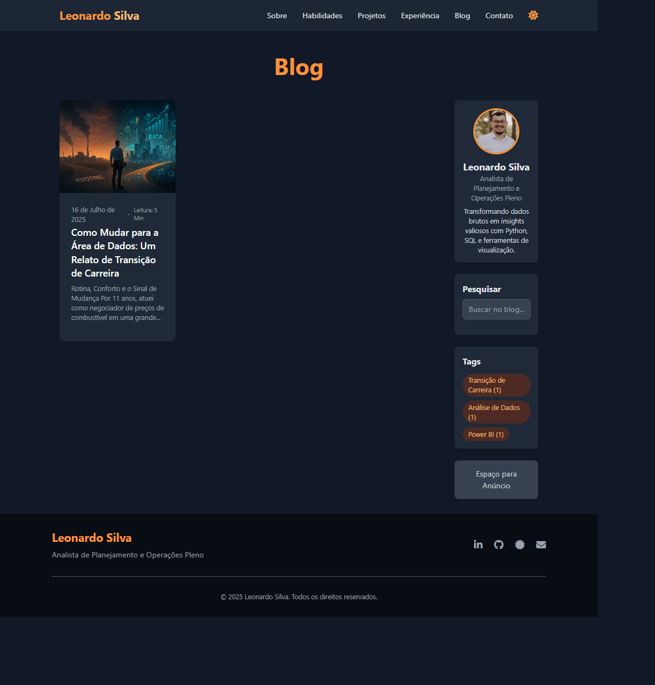

# Blog Pessoal & Portfólio de Leonardo Silva


**Visite o site ao vivo:** [**https://blog-oleonardof.pages.dev/**](https://blog-oleonardof.pages.dev/)



---

## 🚀 Sobre o Projeto

Este projeto foi concebido com um duplo propósito: servir como meu blog e portfólio pessoal e, igualmente importante, funcionar como um **template robusto e de fácil customização**. A intenção é que outros profissionais, especialmente aqueles que desejam ter uma presença online de alta qualidade, possam usar este repositório como um ponto de partida acelerado para criar um portfólio e um blog integrados.

## 🤖 Filosofia e Desenvolvimento com IA

Um diferencial fundamental deste repositório é que ele foi **100% desenvolvido com o auxílio de Inteligência Artificial (Google Gemini Pro)**. A filosofia por trás disso é democratizar o acesso a um site profissional e funcional.

Desde a estruturação inicial do Jekyll, passando pela estilização com Tailwind CSS, até a implementação de funcionalidades complexas como a pesquisa no lado do cliente e o sistema de comentários com giscus, cada passo foi guiado e gerado em colaboração com a IA.

A ideia é que este projeto sirva como uma prova de conceito e um guia prático, facilitando para que **pessoas sem conhecimento aprofundado em linguagens de desenvolvimento possam se beneficiar** e criar seus próprios sites com o mínimo de atrito técnico.

## ✨ Principais Funcionalidades

O blog foi construído com um conjunto de funcionalidades para melhorar a experiência do usuário e o engajamento:

* **Design Consistente:** O layout do blog, incluindo cabeçalho, rodapé e paleta de cores, é o mesmo do portfólio.
* **Layout Responsivo com Sidebar:** A página inicial e os posts individuais possuem um layout de 2 colunas em telas maiores, com uma sidebar para informações adicionais.
* **Modo Claro e Escuro:** Um botão de toggle permite ao usuário alternar entre os temas, com a preferência salva no navegador.
* **Tempo de Leitura Estimado:** Cada post exibe uma estimativa de tempo de leitura.
* **Sistema de Tags:** Os posts são categorizados com tags, e o site gera páginas de arquivo automaticamente para cada tag.
* **Pesquisa Funcional:** Uma barra de pesquisa implementada com `Simple-Jekyll-Search` que busca nos títulos e conteúdo dos posts.
* **Compartilhamento Social:** Botões para compartilhar os artigos em diversas redes sociais.
* **Comentários e Reações:** Sistema de comentários integrado com as "Discussions" do GitHub através do `giscus`.
* **Navegação entre Posts:** Botões de "Anterior" e "Próximo" no final de cada artigo.
* **SEO Otimizado:** Geração automática de `sitemap.xml`, `robots.txt` e meta tags com o `jekyll-seo-tag`.

## 🛠️ Tecnologias Utilizadas

* **Gerador de Site Estático:** Jekyll
* **Linguagem de Template:** Liquid
* **Estilização:** Tailwind CSS (via CDN Play)
* **JavaScript:** Vanilla JS para interatividade
* **Pesquisa:** Simple-Jekyll-Search
* **Comentários:** giscus
* **Ícones:** Font Awesome
* **Hospedagem:** Cloudflare Pages

## ⚙️ Como Executar Localmente

Para rodar este projeto no seu computador, você precisará ter o Ruby e o Bundler instalados.

1.  **Clone o repositório:**
    ```bash
    git clone [https://github.com/oleonardof/blog.git](https://github.com/oleonardof/blog.git)
    ```
2.  **Navegue até a pasta do projeto:**
    ```bash
    cd blog
    ```
3.  **Instale as dependências listadas no `Gemfile`:**
    ```bash
    bundle install
    ```
4.  **Inicie o servidor local do Jekyll:**
    ```bash
    bundle exec jekyll serve
    ```
5.  Abra seu navegador e acesse `http://localhost:4000`.

## 📜 Licença

O conteúdo e o código deste projeto estão sob uma licença customizada que permite a visualização para fins pessoais e não comerciais, mas não a cópia ou distribuição. Para mais detalhes, veja o arquivo [LICENSE](LICENSE).

---

**Leonardo Silva** - [LinkedIn](https://www.linkedin.com/in/oleonardof/) · [GitHub](https://github.com/oleonardof)